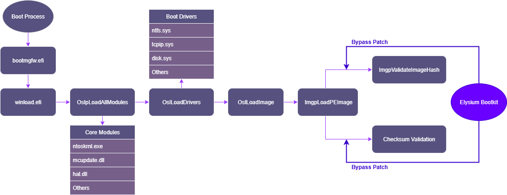
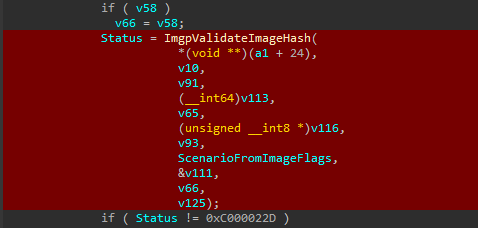
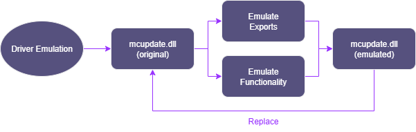
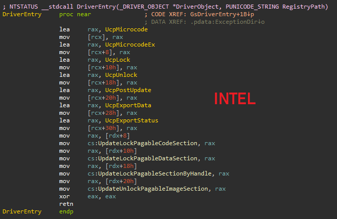
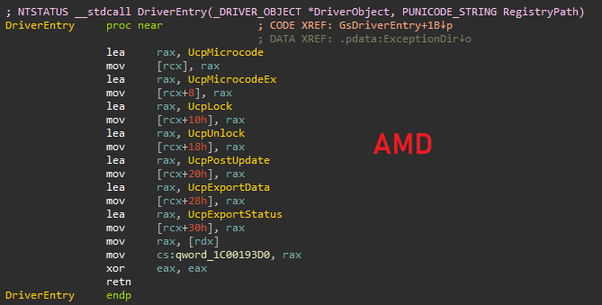
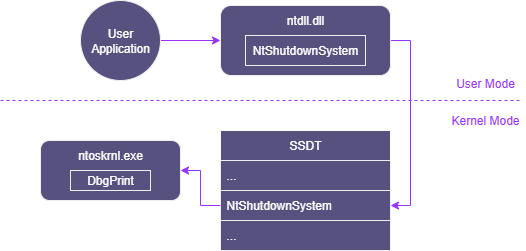
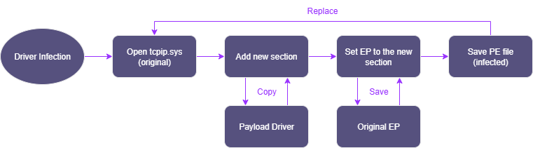

# Elysium

  

Elysium is a UEFI Windows bootkit framework that patching winload.efi to bypass Windows boot-time code integrity checks and unlock powerful attacks capabilities.
By patching ImgpValidateImageHash and the checksum verification in OslLoadImage, it becomes possible to load unsigned, modified, or even completely custom boot components.

## Examples

* **Driver Loading**   [Example](Examples/DriverLoading) [About](#1-loading-arbitrary-boot-drivers) 
  Load any driver (unsigned, test-signed, or modified) simply by creating a boot-start service.

* **Driver Emulation**   [Example](Examples/DriverEmulation) [About](#2-boot-drivers-emulation) 
  Swap the Microcode Update Library with an emulated version while maintaining system stability.

* **Kernel Backdoor**   [Example](Examples/KernelBackdoor) [About](#3-kernel-binary-backdoor) 
  Patch ntoskrnl.exe to redirect SSDT syscalls (e.g., NtShutdownSystem) to arbitrary kernel functions (e.g., DbgPrint).

* **Driver Infection**   [Example](Examples/DriverInfection) [About](#4-kernel-driver-infection) 
  Infect boot-start drivers with payload driver by injecting shellcode into an RWX section and redirecting the entry point, while preserving normal execution.

## Background

A couple of months ago, while reversing winload.efi, I got the idea to patch the boot driver certificate check so unsigned drivers could be loaded without being blocked. I started looking into whether this kind of bypass was even possible.
At first, I only wanted to use it to load any driver I wanted, but it turned out this could be used for a lot more, which I’ll show next.

    

## Inside winload.efi: Code Integrity

Before we dive into how Code Integrity works in winload.efi, we first need to understand where the drivers are loaded from.
Windows loads drivers in two main stages: winload.efi and ntoskrnl.exe.
Here’s a simplified hierarchy of drivers based on their start type:

| Driver Type     | Start Value | Loaded By         | Notes                               |
| --------------- | ----------- | ----------------- | ----------------------------------- |
| ELAM            | 0 (special) | winload.efi       | Loads **before boot-start drivers** |
| Boot Start      | 0           | winload.efi       | Critical for boot, must be signed   |
| System Start    | 1           | ntoskrnl.exe      | Early kernel initialization         |
| Auto-Start      | 2           | I/O Manager / SCM | After kernel/user init              |
| Demand / Manual | 3           | On request        | Loaded when needed                  |
| Disabled        | 4           | Never             | Not loaded                          |

Understanding this hierarchy is important because it shows exactly where we can intervene in the driver loading process.
In winload.efi, both Boot Start and ELAM drivers are loaded.

Boot-start drivers are loaded via OslLoadDrivers inside winload.efi, which parses the SYSTEM registry hive (HKLM\SYSTEM\CurrentControlSet\Services) to enumerate all drivers marked with Start = 0.
It then maps them into memory and prepares their loader data blocks.

Within OslLoadDrivers, the function OslLoadImage handles the actual image loading. 
Internally, it calls LdrpLoadImage, then BlImgLoadPEImageEx, and finally ImgpLoadPEImage.

In ImgpLoadPEImage, the ImgpValidateImageHash function is called to check the image certificate against the trusted boot policy. 
By patching this function, we can skip certificate validation entirely.

In addition, function ImgpLoadPEImage performs a checksum validation to detect tampering.
The exact logic can be seen in the ReactOS source code.
Patching this lets us modify the binary without needing to recalculate the checksums.

Together, these two patches open up a wide range of possibilities, going far beyond just loading a custom driver.

## 1. Loading Arbitrary Boot Drivers

As this was originally meant, this patch enables loading of drivers regardless of their signature status, including unsigned, test-signed, or expired drivers.
The only requirement for the driver that it must start at Boot.

In theory, we can also load our own ELAM driver, but I have not tested that. 

In the project example, I have created a batch script that will automatically create the driver service. 
The script sets the driver’s start type to BOOT_START, ensuring it loads during boot from winload.efi and bypasses certificate validation.

Once the script is executed, all you need to do is restart the system. After the reboot, the driver will be executed automatically.

## 2. Boot Drivers Emulation

    

Here comes the first capability that was not originally meant to exist.

We can replace any already existing boot-start driver with our crafted one. This allows us to hijack any core boot driver: tcpip.sys, disk.sys, ACPI.sys, and others.

Yes, we can hijack any system-critical boot driver, but the challenge is: how can we make the system continue to function without it?

My approach to this problem is Driver Emulation. Essentially, we emulate the behavior or functionality of the critical driver to keep the system “breathing.”

If the system relies on the driver’s exports, we can replicate them; if it relies on specific driver functionality, we can mimic that behavior as well.

### Staying undetected from ELAM

Yes, we can hijack and emulate any boot-start driver, but this approach can potentially be detected by the ELAM (Early Launch Anti-Malware) driver.

ELAM is designed to check boot-start drivers for common malware signatures and is primarily used by AV software to detect malicious activity. 
While it should not touch our driver, as it is not a commonly known threat, in theory ELAM could notice our invalid certificate in a driver.

So, how can we counter this?

The ELAM driver itself is loaded before any boot-start driver, but there are core components that load even earlier. 
One such component is the Microcode Update Library, which I have chosen to target.

Here, the emulation technique is ideal because this driver exposes one simple interface that is used by the system and one exported variable. 
By emulating its behavior, we can mimic the original functionality and make the system believe that the update library is operating normally.

The system provides two versions of the microcode update library: one for AMD processors (mcupdate_AuthenticAMD.dll) and one for Intel processors (mcupdate_GenuineIntel.dll).

If we examine the entry of both drivers, we can see that they expose a very similar interface to the operating system:

    
    

From the perspective of system components, it doesn’t matter which CPU vendor is present; all they need is a consistent interface to perform microcode updates.

In the project example, I'm emulating this driver to achieve arbitrary code execution in a separate thread without breaking the system. 
I'm redirecting the interface structure functions to the success ROP gadgets, allowing the system to believe that the update functions are working as intended.

The most interesting part is figuring out how to achieve code execution at runtime. 
This library executes even before all boot-start drivers, just a few lines after the kernel image itself is loaded.
When this library runs, we are still operating in a firmware context, where memory padding has not yet been allocated and the system is still using physical memory directly.
At this point, the AP (Application Processor) cores have not even started, and we are running solely on the BSP (Bootstrap Processor) core.
This means we can’t simply create a thread yet, since threading does not exist at this stage.

Another interesting detail is that this library’s entry point is executed three times during the boot process, with two of those calls coming from ntoskrnl.exe.
In theory, we could hook into execution directly from DriverEntry, but I decided to take a different approach.

I came up with the idea of using one of the functions exposed by this interface to gain execution. 
I traced all of these calls to determine which ones are executed during the system boot process, how many times they run, and from where.

Through this analysis, I identified two interface functions that are invoked by ntoskrnl.exe during boot. 
One of them, HalpMcUpdateExportData, is called directly by ntoskrnl.exe during its initialization phase.

As we can see, ntoskrnl.exe calls the exported function from our interface twice, but only if the first call returns STATUS_BUFFER_TOO_SMALL.
Since we want to execute it only once, we’ll just return success.

The final problem before achieving runtime code execution is that we cannot simply create a thread even from this execution. 
At this point, we are still in the early initialization phase of ntoskrnl.exe, where thread-related structures are not yet fully initialized.

However, we can work around this by registering a load image notification callback using PsSetLoadImageNotifyRoutine.
This callback will be triggered when the first process in the system (typically smss.exe) is loaded. 
From this point onward, it becomes safe to create a thread and continue execution.

You can see [here](https://www.youtube.com/embed/y7h2q-aL4wE) in the video how execution looks with the thread call stack.

## 3. Kernel Binary Backdoor

    

Here, I also reveal another capability that I hadn’t planned.

The bootkit is patching the OslLoadImage function to allow loading of unsigned and patched images. 
The interesting part is that ntoskrnl.exe itself is loaded through this function. 
That means we can not only patch the kernel but, in theory, also hijack, emulate, or even fake it.

In this case, since the kernel binary can be patched, I came up with an approach similar to what I used in the Insomnia bootkit. 
In Insomnia, we patched the SSDT to redirect syscall to our custom payload. 
Here, we take a slightly different approach: we can patch the SSDT to redirect a user-mode syscall to a different kernel function.

For example, we could make that a call to NtShutdownSystem from user-mode instead will execute MmCopyVirtualMemory. 
If you want to dive deeper into how the SSDT works, you can check out my Insomnia bootkit write-up, where I cover it in much more detail.

In this project example, I created a Python script that parses the PE file’s DIRECTORY_ENTRY_DEBUG to extract the PDB (Program Database) file information. 
The script then downloads the corresponding PDB file from Microsoft servers and retrieves the KiServiceTable symbol address.

At runtime, KiServiceTable contains the packed syscall function addresses, while in the raw file it only contains RVA offsets. 
The script patches a given syscall function to redirect it to another specified function. 
The only requirement is that both the original syscall and the target redirect function must be exported by the PE file. 
My script automatically gathers the RVAs from the exports, so both functions need to be exported for the patch to work.

And finally I made a simple PoC that shows the usage of redirected NtShutdownSystem to DbgPrint, which prints the message by executing NtShutdownSystem from user-mode.

## 4. Kernel Driver Infection

    

Since we can not only hijack but also patch boot drivers, I came up with the idea of infecting them with a crafted image.

I implemented this by injecting custom image data as shellcode into a newly created section with RWX permissions, then updating the driver’s entry point to point to our image’s entry.

For this project, I built two components:

* **Infector** (user-mode application) – infects a given legitimate driver with the payload.

* **Payload** (kernel driver) – contains the actual infection execution that runs in the kernel.

The infector hides the driver’s original **entry point** inside the PE headers, specifically in OptionalHeader.LoaderFlags.
At runtime, we retrieve this value and call the original entry point to keep original driver execution.

This approach effectively lets us infect the kernel driver with a crafted image.
This method can be applied to any boot-start driver to infect it in the same way.

You can see [here](https://www.youtube.com/embed/ly3BSyPj1wA) in the video how it looks with callstack.

## Detection, HVCI, and Patch Guard

This bootkit targets only winload.efi, applying its patch early in the boot process. After ExitBootServices, the bootkit completely unloads, leaving no runtime traces in memory. At the point when winload.efi loads boot drivers, these drivers are merely loaded into memory but not executed, so they cannot detect the patch.

HVCI (Hypervisor-protected Code Integrity) enforces kernel-mode code integrity via CI.dll, but it does not monitor or protect winload.efi. This means that modifications to the bootloader can bypass HVCI checks entirely.

Patch Guard (Kernel Patch Protection) activates only after ntoskrnl.exe has been fully initialized. Since the bootkit patches winload.efi, it executes before Patch Guard is active, leaving the bootloader unprotected by this mechanism.

## Compatibility

Elysium and all examples are built and tested on Windows 10 22H2, but they are expected to work on other Windows 10 versions (20H2, 21H1, 21H2).  
Windows 11 has not been tested and may not be supported.
